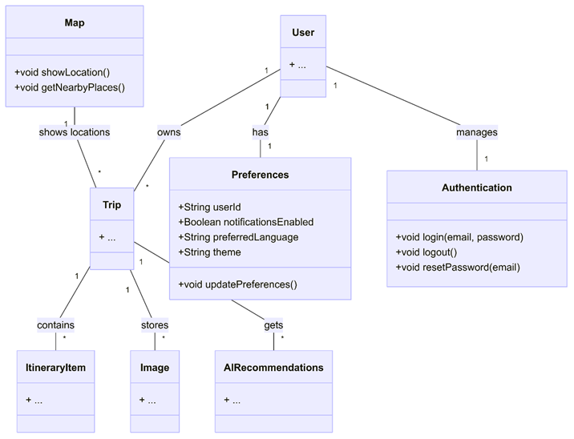

# 📐 Diseño Arquitectónico de Travel Planner

## 🏛️ Arquitectura General
Travel Planner sigue una arquitectura **MVVM (Model-View-ViewModel)** para una mejor separación de responsabilidades y escalabilidad.

## 📊 Modelo de Datos: Creado completo para futuros Sprints



---

## 🗄️ Esquema de Base de Datos – Sprint 03

### Tabla: `trips`

Almacena todos los viajes. Cada viaje pertenece a un usuario mediante `owner_user_id`.

| Columna | Tipo | Restricciones | Descripción |
|---------|------|---------------|-------------|
| `trip_id` | TEXT | PRIMARY KEY | UUID generado al crear |
| `title` | TEXT | NOT NULL | Nombre del viaje |
| `destination` | TEXT | NOT NULL | Ciudad/país de destino |
| `owner_user_id` | TEXT | NOT NULL, INDEX | UID de Firebase del propietario |
| `start_date_epoch_millis` | INTEGER (Long) | NOT NULL | Fecha inicio en epoch ms |
| `end_date_epoch_millis` | INTEGER (Long) | NOT NULL | Fecha fin en epoch ms |
| `description` | TEXT | NOT NULL | Notas del viaje |
| `budget_amount` | INTEGER | NOT NULL | Importe del presupuesto |
| `budget_currency` | TEXT | NOT NULL | Código de moneda (p. ej. EUR) |
| `cover_emoji` | TEXT | NOT NULL | Emoji del viaje |

**Índices:** `owner_user_id`, `title`, `destination`

---

### Tabla: `itinerary_items`

Almacena las actividades de cada viaje. Vinculada a `trips` con FK CASCADE DELETE.

| Columna | Tipo | Restricciones | Descripción |
|---------|------|---------------|-------------|
| `item_id` | TEXT | PRIMARY KEY | UUID generado al crear |
| `trip_owner_id` | TEXT | NOT NULL, FK → trips.trip_id | Viaje al que pertenece |
| `title` | TEXT | NOT NULL | Nombre de la actividad |
| `description` | TEXT | NOT NULL | Detalles de la actividad |
| `scheduled_at_epoch_millis` | INTEGER (Long) | NOT NULL, INDEX | Fecha/hora programada en epoch ms |
| `duration_minutes` | INTEGER | NOT NULL | Duración en minutos |
| `display_order` | INTEGER | NOT NULL | Orden de visualización |
| `is_done` | INTEGER (Boolean) | NOT NULL, DEFAULT 0 | Si la actividad está completada |

**Índices:** `trip_owner_id`, `scheduled_at_epoch_millis`
**Foreign key:** `trip_owner_id → trips.trip_id` con `ON DELETE CASCADE`

---

### Tabla: `users`

Almacena el perfil local del usuario. El `user_id` coincide con el UID de Firebase.

| Columna | Tipo | Restricciones | Descripción |
|---------|------|---------------|-------------|
| `user_id` | TEXT | PRIMARY KEY | UID de Firebase |
| `login_email` | TEXT | NOT NULL | Email de acceso |
| `username` | TEXT | NOT NULL, UNIQUE | Nombre de usuario (único) |
| `birth_date` | INTEGER (Date) | NULLABLE | Fecha de nacimiento en epoch ms |
| `address` | TEXT | NOT NULL | Dirección |
| `country` | TEXT | NOT NULL | País |
| `phone` | TEXT | NOT NULL | Teléfono |
| `accepts_marketing_emails` | INTEGER (Boolean) | NOT NULL | Consentimiento de marketing |

**Índices:** `username` (UNIQUE)

---

## 🔗 Relaciones entre Tablas

```
users (user_id)
    │
    │ 1:N (owner_user_id)
    ▼
trips (trip_id)
    │
    │ 1:N (trip_owner_id) CASCADE DELETE
    ▼
itinerary_items (item_id)
```

- Un usuario puede tener muchos viajes.
- Un viaje puede tener muchos ítems de itinerario.
- Al borrar un viaje se borran automáticamente todos sus ítems.
- Cada usuario solo ve sus propios viajes (filtrados por `owner_user_id`).

---

## 🔄 Estrategia de Migración

### Versión 1 → 2 (`MIGRATION_1_2`)

Aplicada al añadir soporte de usuarios y vincular viajes a usuarios.

**Cambios:**
1. Creación de la tabla `users`.
2. Índice UNIQUE sobre `users.username`.
3. Añadida columna `owner_user_id` en `trips` (valor por defecto: `'legacy_local_user'`).
4. Índice sobre `trips.owner_user_id`.

```sql
CREATE TABLE IF NOT EXISTS `users` (
    `user_id` TEXT NOT NULL,
    `login_email` TEXT NOT NULL,
    `username` TEXT NOT NULL,
    `birth_date` INTEGER,
    `address` TEXT NOT NULL,
    `country` TEXT NOT NULL,
    `phone` TEXT NOT NULL,
    `accepts_marketing_emails` INTEGER NOT NULL,
    PRIMARY KEY(`user_id`)
);

CREATE UNIQUE INDEX IF NOT EXISTS `index_users_username` ON `users` (`username`);

ALTER TABLE `trips` ADD COLUMN `owner_user_id` TEXT NOT NULL DEFAULT 'legacy_local_user';

CREATE INDEX IF NOT EXISTS `index_trips_owner_user_id` ON `trips` (`owner_user_id`);
```

> **Nota:** Los viajes existentes de la v1 se asignan a `legacy_local_user` y se reasignan al UID real de Firebase en el primer login mediante `reassignTripsToOwner()`.

---

## ✅ Validación de Datos (T5.2)

Toda la validación se realiza en la capa **ViewModel** antes de enviar datos al repositorio.

### Validaciones de viajes (`TripListViewModel`)

| Regla | Mensaje de error |
|-------|-----------------|
| Todos los campos son obligatorios | `"All fields are required"` |
| El nombre debe tener mínimo 3 caracteres | `"Trip name must be at least 3 characters"` |
| La fecha de inicio debe ser anterior a la de fin | `"Start date must be before end date"` |
| El formato de fecha debe ser `dd/MM/yyyy` | `"Invalid date format (dd/MM/yyyy)"` |
| No puede existir otro viaje con el mismo nombre | `"A trip with this name already exists"` |

### Validaciones de actividades (`TripListViewModel`)

| Regla | Mensaje de error |
|-------|-----------------|
| La fecha debe estar dentro del rango del viaje | `"Activity date must be within trip date range"` |
| No puede existir otra actividad con el mismo nombre en el mismo viaje | `"An activity with this name already exists in this trip"` |

### Validaciones de usuario (`UserDao`)

| Regla | Implementación |
|-------|---------------|
| El username debe ser único | `countUsersByUsernameExcludingUserId` devuelve > 0 → rechazado |

---

## 📋 Resumen de Operaciones DAO

### TripDao
| Método | Descripción |
|--------|-------------|
| `insertTrip` | Insertar o reemplazar un viaje |
| `observeTripsByOwner` | Flow de viajes de un usuario (actualizaciones en vivo) |
| `getTripsByOwner` | Snapshot de viajes de un usuario |
| `getTripByIdForOwner` | Obtener un viaje por ID y propietario |
| `reassignTripsToOwner` | Migrar viajes legacy a un usuario real |
| `updateTrip` | Actualizar un viaje existente |
| `deleteTripById` | Eliminar un viaje por ID |

### ItineraryItemDao
| Método | Descripción |
|--------|-------------|
| `insertItem` | Insertar o reemplazar un ítem |
| `observeItemsByTrip` | Flow de ítems de un viaje (actualizaciones en vivo) |
| `getItemsByTrip` | Snapshot de ítems de un viaje |
| `countItemsByTrip` | Contar ítems de un viaje |
| `updateItem` | Actualizar un ítem existente |
| `deleteItemById` | Eliminar un ítem por ID |
| `deleteItemsByTripId` | Eliminar todos los ítems de un viaje |

### UserDao
| Método | Descripción |
|--------|-------------|
| `insertUser` | Insertar o reemplazar un perfil de usuario |
| `updateUser` | Actualizar perfil de usuario |
| `getUserById` | Obtener perfil por UID de Firebase |
| `observeUserById` | Flow de perfil de usuario (actualizaciones en vivo) |
| `countUsersByUsernameExcludingUserId` | Comprobar si el username ya está en uso |

---

## 📝 Logging con Logcat (T5.3)

Se usan logs en dos capas: **ViewModel** y **Repository**.

### Niveles de log utilizados

| Nivel | Uso |
|-------|-----|
| `Log.d` (DEBUG) | Estado interno, flujos de datos, selección de viaje |
| `Log.i` (INFO) | Operaciones CRUD completadas correctamente |
| `Log.w` (WARN) | Situaciones inesperadas no críticas (usuario no autenticado, viaje no encontrado) |
| `Log.e` (ERROR) | Errores de validación, excepciones, fallos de BD |

### Tags utilizados

| Clase | Tag |
|-------|-----|
| `TripListViewModel` | `"TripListViewModel"` |
| `TripRepositoryImpl` | `"TripRepositoryImpl"` |
| `AuthViewModel` | `"AuthViewModel"` |
| `AuthRepositoryImpl` | `"AuthRepository"` |

### Ejemplos de logs en Logcat

```
I/TripListViewModel: Viaje creado correctamente: id=abc-123 title='Tokyo Adventure'
E/TripListViewModel: Error de validación: nombre duplicado → 'Tokyo Adventure'
I/TripRepositoryImpl: addTrip: viaje insertado correctamente id=abc-123
W/TripRepositoryImpl: getTripById: viaje no encontrado id=xyz-999
I/AuthRepository: signIn: login correcto para email=user@example.com
E/AuthRepository: signIn: error → The email address is badly formatted
```

---

## 🔐 Autenticación

La autenticación se gestiona con **Firebase Authentication** (email/contraseña).

| Funcionalidad | Implementación |
|---------------|----------------|
| Login | `FirebaseAuth.signInWithEmailAndPassword` |
| Registro | `FirebaseAuth.createUserWithEmailAndPassword` |
| Logout | `FirebaseAuth.signOut` |
| Recuperar contraseña | `FirebaseAuth.sendPasswordResetEmail` |
| Comprobar sesión | `FirebaseAuth.currentUser != null` |

El UID de Firebase se usa como `user_id` en la tabla `users` y como `owner_user_id` en `trips`.

---

## 🔁 Ejemplo de Flujo de Datos

### Crear un nuevo viaje
```
NewTripScreen
    → TripListViewModel.addTrip(...)
        → validateTrip() → comprueba campos, fechas, duplicados
        → repository.addTrip(trip)
    → TripRepositoryImpl.addTrip(...)
        → tripDao.insertTrip(TripEntity)
        → SQLite (tabla trips)
    → TripDao.observeTripsByOwner emite nueva lista
    → TripListViewModel.trips StateFlow se actualiza
    → HomeScreen se recompone automáticamente
```

### Crear una actividad (con validación de rango)
```
AddActivityScreen
    → TripListViewModel.addActivity(tripId, title, date, ...)
        → getTripById(tripId) → obtiene fechas del viaje
        → parseDate(date) → valida formato
        → comprueba que date ∈ [tripStart, tripEnd]
        → comprueba título duplicado en el viaje
        → repository.addActivity(activity)
    → TripRepositoryImpl.addActivity(...)
        → itineraryItemDao.insertItem(ItineraryItemEntity)
    → observeActivitiesByTrip emite lista actualizada
    → TripDetailScreen se recompone automáticamente
```

---

*Última actualización: Sprint 03 – T5.4*